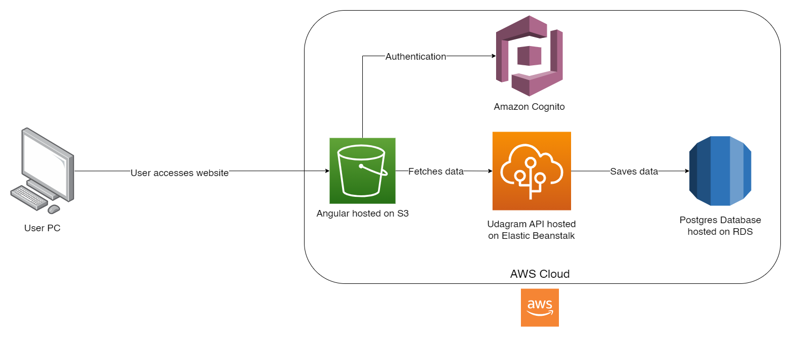

# Infrastructure Description

Udagram's infrastructure is based on the AWS cloud. It makes use of these AWS Services:
- S3 Bucket
- Amazon Cognito
- Elastic Beanstalk
- RDS

## AWS Architecture Diagram

This diagram shows how all the services connect to each other. When the user wishes to access the website, they head to the URL which is hosted via the S3 bucket. 

Upon reaching the website, if they log in, they will be authenticated via Amazon Cognito and checked within the backend database for username and password information. Images and posts are stored within the RDS database which the udagram-api accesses hosted via the Elastic Beanstalk. This is then sent to the frontend where it can be displayed.
