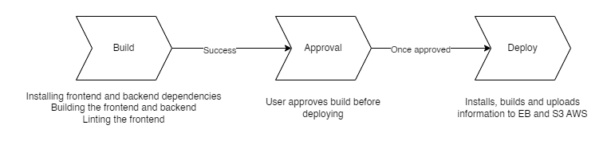

# Pipeline Description

Udagram's CircleCI pipeline has three stages: 
- Stage 1 - Build
- Stage 2 - Hold
- Stage 3 - Deploy

## CircleCI Pipeline Diagram

This diagram shows how the pipeline works. Firstly, whenever GitHub recieves new changes, CircleCI will fire off and begin the CD/CI pipeline.

## Stage 1 - Build
During the build stage, the pipeline will test that the code is working and ready to be deployed. It does this via installing all dependencies for the frontend and API, building the frontend and API and linting the frontend.

## Stage 2 - Hold
The hold stage waits for approval to continue onto the deploy stage. This is to prevent any accidental bugs being automatically deployed.

## Stage 3 - Deploy
After approval has been given, the pipeline begins the deploy stage. This is where the AWS Cloud services of S3 and EB are made use of. The frontend is installed, built and uploaded to the S3 service whilst the API is installed and built on the EB service.
